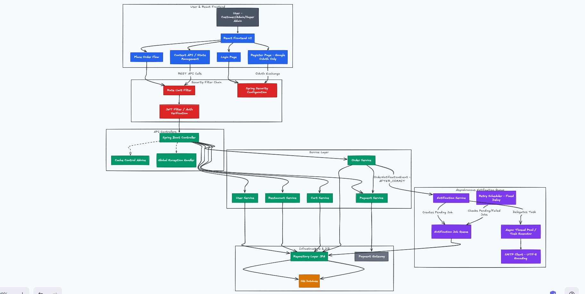

# 🍜 Food Flow

A production-grade, full-stack food ordering platform built with React and Spring Boot. Food Flow is designed for real-world use — it handles multi-role access, secure Google OAuth login, persistent cart management, real-time order tracking, and asynchronous email receipts with detailed billing. Every layer is tested, secured, and built to scale.

---

## 📸 System Architecture

The diagram below shows how a request travels from the browser, through the React UI, into the Spring Boot security filter chain, through the service layer, into the database, and then triggers the async email notification pipeline after a successful order.



---

## 🗄️ Database Design

The entity-relationship diagram below covers all 9 tables, every column type, primary keys, foreign key cascades, check constraints, unique constraints, and the indexes used to keep queries fast at scale.


---

## 📖 About the Project

Food Flow started as a food ordering app and grew into a fully production-ready platform. The goal was to build something that solves real problems — no buggy logout loops, no duplicate orders on network retries, no emails that silently fail, and no insecure endpoints. Every decision was made with production in mind.

The backend is a Spring Boot 3 application running on Java 17. It uses Spring Security with a carefully ordered filter chain — the JWT filter runs before CSRF, which stops the logout loop that happens when authenticated requests get caught by CSRF validation. On top of that, a custom rate limiting filter blocks brute-force attempts on every endpoint.

The frontend is a React 18 app built with Vite and TypeScript. Authentication is handled exclusively through Google OAuth — there is no manual registration form. This removes the need to handle password storage on the client side entirely. After a successful Google login, the backend issues a JWT that the frontend stores and sends with every API request.

Orders are protected by idempotency keys. If a user clicks "Place Order" twice because of a slow network, the second request is silently deduplicated — no double charges, no duplicate entries in the database.

Email notifications follow the out-box pattern. When an order is placed, the email is not sent immediately. Instead, a `notification_jobs` record is written to the database inside the same transaction. A background async thread picks it up and sends the email after the transaction commits. If the SMTP server is temporarily unreachable, a scheduled retry job picks up failed notifications with exponential back-off and tries again automatically.

---

## ✨ Features

### 🔐 Authentication and Security

- Google OAuth 2.0 is the only sign-in method — no username and password forms
- JWT tokens carry user identity and role on every request
- Token versioning means a password change immediately invalidates all existing sessions
- A rate limiting filter is applied globally to prevent request flooding
- The JWT filter runs before the CSRF filter to prevent redirect loops on authenticated mutations
- Idempotency keys on orders guarantee that retried requests never create duplicate entries

### 🍽️ Customer Features

- Browse a curated list of active restaurants on the home page
- Navigate to any restaurant and explore its full menu with categories and prices
- Add items to a persistent cart that survives page refreshes and navigation
- Manage cart quantities and remove items before checkout
- Choose between Cash on Delivery and online payment at checkout
- See a live order status timeline after placing an order
- Browse full order history with itemised details and billing breakdown
- Update personal profile and delivery address from the profile page

### 🏢 Admin Features

- Manage the restaurant you own — update details, activate or deactivate it
- Add, edit, or remove menu items and control their availability
- View all incoming orders for your restaurant and update their status
- Access an analytics dashboard showing revenue, order counts, and performance data

### 👑 Super Admin Features

- View and manage every user account on the platform
- Oversee all restaurants across the platform
- Access global analytics covering total revenue, all orders, and top restaurants
- Assign and change user roles

### 📧 Email Notifications

- Every confirmed order triggers a rich email receipt sent to the customer
- The email includes the restaurant name, every item ordered with quantity and unit price, the subtotal, delivery fee, taxes at 8%, and the final total
- The subject line and body use ordinal wording — for example, "This is your 5th order from AnTeRa Kitchen"
- The rupee symbol and all unicode characters render correctly using a UTF-8 SMTP client
- Failed emails are retried automatically with exponential back-off at 5s, 10s, 20s, and 40s intervals

---

## 🏗️ Tech Stack

| Layer | Technology | Purpose |
|---|---|---|
| Frontend | React 18 + Vite + TypeScript | SPA with fast dev experience and type safety |
| State Management | React Context API + custom hooks | Cart, auth, and data-fetching state |
| Backend | Spring Boot 3 + Java 17 | RESTful API server |
| Security | Spring Security + JWT + OAuth2 | Authentication, CSRF, rate limiting |
| ORM | Spring Data JPA + Hibernate | Database abstraction layer |
| Database | MySQL 8 / PostgreSQL | Primary relational data store |
| Migrations | Flyway | Versioned schema evolution |
| Email | Custom SMTP Client (UTF-8) | Transactional order confirmation emails |
| Async Jobs | Spring @Async + @Scheduled | Non-blocking background email delivery |
| API Docs | SpringDoc OpenAPI + Swagger UI | Auto-generated interactive documentation |
| Testing | JUnit 5 + Spring Boot Test | 32 integration tests, 0 failures |

---

## 📁 Project Structure

```
Food-Ordering-Application/
│
├── backend/
│   └── src/main/java/
│       ├── controller/       REST API endpoints
│       ├── service/          Business logic
│       ├── repository/       JPA data access
│       ├── model/            JPA entity classes
│       ├── dto/              Request and response DTOs
│       ├── security/         JWT filter, CSRF config, rate limiter
│       ├── event/            Domain events (OrderNotificationEvent)
│       ├── exception/        Custom exception classes
│       ├── util/             SMTP client, cache advice, ApiError
│       └── config/           Async executor, OpenAPI, app config
│   └── src/main/resources/
│       ├── db/migration/mysql/         MySQL migrations V1 to V6
│       ├── db/migration/postgresql/    PostgreSQL migrations V1 to V6
│       └── application.properties
│   └── src/test/
│       └── HardeningTests.java         32 integration tests
│
├── frontend/
│   └── src/
│       ├── pages/
│       │   ├── auth/         Login, Register (Google OAuth only)
│       │   ├── customer/     Home, Restaurants, Menu, Cart,
│       │   │                 Checkout, Orders, Tracking, Profile
│       │   ├── admin/        Admin order and menu management
│       │   └── super/        Super admin users and restaurants
│       ├── components/       Shared UI components
│       ├── context/          AuthContext, CartContext
│       ├── hooks/            Data-fetching hooks
│       ├── apis/             Typed API client
│       └── types/            Shared TypeScript interfaces
│
├── images/
│   ├── FoodFlow-Architecture.png
│   └── FoofFlow-Db Design.png
│
├── .env
├── DEPLOYMENT.md
└── README.md
```

---

## ⚡ Getting Started

### Prerequisites

| Tool | Version |
|---|---|
| Java JDK | 17 or higher |
| Maven | 3.9 or higher |
| Node.js | 18 or higher |
| MySQL | 8.0 or higher |

### 1. Clone the repository

```bash
git clone https://github.com/your-username/food-flow.git
cd food-flow
```

### 2. Set up environment variables

```bash
cp .env.example .env
```

Open `.env` and fill in the values:

```env
# Database
SPRING_DATASOURCE_URL=jdbc:mysql://localhost:3306/foodflow
SPRING_DATASOURCE_USERNAME=root
SPRING_DATASOURCE_PASSWORD=yourpassword

# Google OAuth — get these from console.cloud.google.com
GOOGLE_CLIENT_ID=your-google-client-id
GOOGLE_CLIENT_SECRET=your-google-client-secret

# SMTP — use a Gmail App Password, not your real password
SMTP_HOST=smtp.gmail.com
SMTP_PORT=587
SMTP_USERNAME=your@gmail.com
SMTP_PASSWORD=your-app-password
SMTP_FROM=noreply@foodflow.com

# JWT
JWT_SECRET=your-very-long-and-secure-random-secret
JWT_EXPIRATION_MS=86400000
```

### 3. Create the database

```bash
mysql -u root -p -e "CREATE DATABASE foodflow;"
```

Flyway will automatically apply all 6 migrations when the backend starts for the first time.

### 4. Start the backend

```bash
cd backend
mvn clean install
mvn spring-boot:run
```

The API is now running at `http://localhost:8080`

Swagger documentation is available at `http://localhost:8080/swagger-ui.html`

### 5. Start the frontend

```bash
cd frontend
npm install
npm run dev
```

Open `http://localhost:5173` in your browser.

---

## 🔑 User Roles

| Role | What they can do |
|---|---|
| Customer | Browse restaurants, manage their cart, place orders, track order status, view order history, update their profile |
| Admin | Manage their own restaurant's details, add and edit menu items, view and update order statuses, access restaurant analytics |
| Super Admin | Full platform access — manage all users, all restaurants, view global analytics and all orders |

---

## 🌐 API Reference

| Method | Endpoint | Description | Access |
|---|---|---|---|
| POST | /api/auth/oauth2/exchange | Exchange Google token for JWT | Public |
| GET | /api/auth/profile | Get current user profile | Any logged-in user |
| GET | /api/customer/restaurants | List all active restaurants | Customer |
| GET | /api/customer/menu/{id} | Get menu for a restaurant | Customer |
| GET | /api/customer/cart | View cart contents | Customer |
| POST | /api/customer/cart/add | Add item to cart | Customer |
| PUT | /api/customer/cart | Update item quantity | Customer |
| DELETE | /api/customer/cart/{itemId} | Remove item from cart | Customer |
| POST | /api/customer/orders | Place a new order | Customer |
| GET | /api/customer/orders | View order history | Customer |
| GET | /api/customer/orders/{id} | Track a specific order | Customer |
| GET | /api/admin/analytics | Restaurant analytics | Admin |
| GET | /api/admin/orders | View restaurant orders | Admin |
| PUT | /api/admin/orders/{id}/status | Update order status | Admin |
| POST | /api/admin/menu | Add a menu item | Admin |
| PUT | /api/admin/menu/{id} | Update a menu item | Admin |
| GET | /api/super/users | List all users | Super Admin |
| GET | /api/super/analytics | Global platform analytics | Super Admin |
| GET | /api/super/restaurants | Manage all restaurants | Super Admin |

---

## 🧪 Testing

```bash
cd backend
mvn test
```

Current results: `Tests run: 32, Failures: 0, Errors: 0, Skipped: 0` ✅

| Category | What is tested |
|---|---|
| Security | Filter chain order, JWT validation, token versioning, rate limiting |
| Cart | Add, update, remove, retrieve cart items |
| Orders | Order creation, cost calculation, idempotency key deduplication |
| Database | FK constraints, check constraints, unique constraints |
| Notifications | Email job creation, retry scheduling |
| Restaurants | CRUD operations, admin assignment, menu management |

---

## 🚀 Deployment

See [DEPLOYMENT.md](DEPLOYMENT.md) for the full production deployment guide.

```bash
# Build the backend JAR
cd backend && mvn clean package -DskipTests

# Build the frontend
cd frontend && npm run build
```

| Component | Recommended platforms |
|---|---|
| Backend JAR | AWS EC2, Railway, Render, Fly.io |
| Frontend dist/ | Vercel, Netlify, Nginx |
| Database | PlanetScale, AWS RDS, Railway MySQL, Neon |

Never commit your `.env` file. Always use your hosting platform's secret or environment variable manager.

---

## 🤝 Contributing

1. Fork the repository
2. Create a feature branch — `git checkout -b feature/my-feature`
3. Write tests for new behaviour
4. Commit with a clear message — `git commit -m "feat: add delivery address autocomplete"`
5. Push and open a pull request

All existing tests must pass before a PR can be merged. New features should include corresponding tests.

---

## 📄 License

This project is licensed under the MIT License. See the [LICENSE](LICENSE) file for details.
